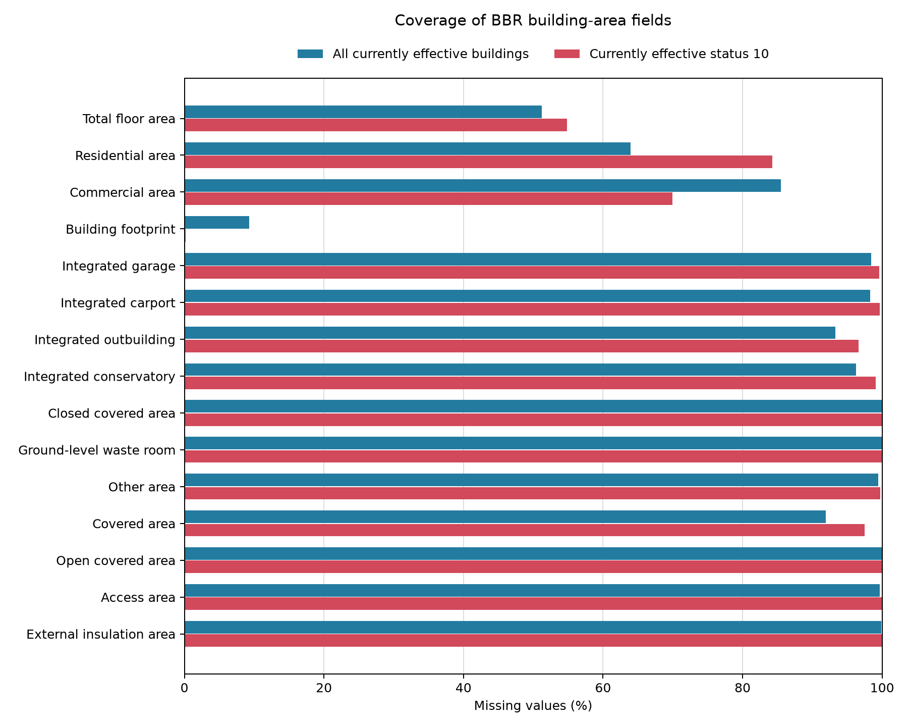

# BBR data-quality assessment

This report is generated from the cleaned temporal Parquet files by
`src/data_quality.py`. It describes data coverage; it does not apply or select a
demolition indicator.

Run it again with:

```bash
.venv/bin/python -m src.data_quality
```

## Dataset overview

| Dataset | Temporal rows | Unique IDs | Currently effective rows | IDs without current row | Mean versions/ID | Maximum versions |
| --- | --- | --- | --- | --- | --- | --- |
| bygning | 33,820,994 | 6,250,075 | 6,250,071 | 4 | 5.41 | 235 |
| bbrsag | 6,507,234 | 1,792,575 | 1,792,541 | 34 | 3.63 | 1,184 |
| sagsniveau | 8,426,674 | 4,277,610 | 3,945,237 | 332,373 | 1.97 | 65 |

A *currently effective row* has both `registreringTil` and `virkningTil`
missing. No ID has more than one such row in this extract. A small number of
`Bygning` and `BBRSag` IDs and a larger group of `Sagsniveau` IDs have no
currently effective row, which is reported separately above. Statistics at
this scope avoid giving extra weight to objects with many historical versions.

## Coverage of analysis-critical fields

| Dataset | Column | Meaning | Missing | Missing share |
| --- | --- | --- | --- | --- |
| bygning | `forretningsproces` | Business process | 1,226 | 0.02% |
| bygning | `byg021BygningensAnvendelse` | Building-use code | 30,873 | 0.49% |
| bygning | `byg026Opførelsesår` | Construction year | 988,380 | 15.81% |
| bbrsag | `sag002Byggesagsdato` | Case date | 315,537 | 17.60% |
| bbrsag | `sag010FuldførelseAfByggeri` | Completion date | 624,092 | 34.82% |
| bbrsag | `sag012Byggesagskode` | Case code | 283 | 0.02% |
| bbrsag | `sag008FærdigtBygningsareal` | Completed building area | 1,773,052 | 98.91% |
| sagsniveau | `sagstype` | Case type | 3,035 | 0.08% |
| sagsniveau | `byggesag` | BBRSag reference | 0 | 0.00% |
| sagsniveau | `stamdataBygning` | Master-building reference | 2,483,873 | 62.96% |
| sagsniveau | `sagsdataBygning` | Case-building reference | 2,483,873 | 62.96% |

The full CSV reports all selected critical fields for both temporal rows and
currently effective rows. High missingness is not automatically an error. For
example, the two `Sagsniveau` building-reference fields are populated only for
records that concern a building, and completed building area in `BBRSag` is an
optional case attribute. These numbers describe the usable coverage for later
joins and indicators; they do not justify filling missing values.

## Principal building-area fields

| Column | Meaning | Missing: all current | Missing: status 10 | Non-positive: status 10 | Median non-null m2 | 95th percentile m2 |
| --- | --- | --- | --- | --- | --- | --- |
| `byg038SamletBygningsareal` | Total floor area | 51.24% | 54.84% | 7,289 | 120 | 701 |
| `byg039BygningensSamledeBoligAreal` | Residential area | 63.91% | 84.24% | 224 | 130 | 313 |
| `byg040BygningensSamledeErhvervsAreal` | Commercial area | 85.46% | 69.91% | 7,379 | 160 | 1,528 |
| `byg041BebyggetAreal` | Building footprint | 9.29% | 0.21% | 0 | 59 | 352 |



Status 10 is included here as one practically relevant quality-check subset,
not as a preferred demolition indicator. The analysis applies the selected
area rule identically to every candidate indicator.

BBR defines `byg038SamletBygningsareal` as the sum of floor areas, excluding
basement and attic area. It cannot be entered for small buildings with use
codes 910-930. BBR defines `byg041BebyggetAreal` as the footprint occupied by
the building when viewed from above. The measures are therefore not
interchangeable even when both are present.

### Study decision

This study uses `byg038SamletBygningsareal` as its only demolished-area
measure, consistent with the area concept used in the comparison literature.
The other area columns remain in this quality audit as context but are not
alternative outcome definitions in the analysis. Missing total floor area is
not filled from footprint or any other field.

Buildings with null or zero total floor area remain relevant for demolition
counts and for documenting coverage, including the concentration of missing
values among outbuildings. Rows with negative total floor area are excluded by
the analysis pipeline using the same rule for every demolition indicator. The
canonical cleaned data retains the original values.

All area-measurement columns are stored as nullable integers, so they cannot
contain floating-point `NaN`; their missing values are represented by nulls.
Zero and negative values are counted separately because they are present values
but cannot represent a positive demolished area.

### Non-positive area values

| Area concept | Zero: all current | Negative: all current | Zero: status 10 | Negative: status 10 |
| --- | --- | --- | --- | --- |
| Total floor area | 79,409 | 16,406 | 7,289 | 0 |
| Residential area | 3,437 | 8,841 | 224 | 0 |
| Commercial area | 87,944 | 24,735 | 7,379 | 0 |
| Building footprint | 17,482 | 22,168 | 0 | 0 |

Negative principal areas occur in currently effective non-status-10 records but
not in the currently effective status-10 subset. Under the study decision,
negative `byg038SamletBygningsareal` records are filtered consistently for all
indicators. Negative values in the other fields remain a diagnostic finding.
Zero total floor area is retained and reported because it provides no square
metres despite being non-null.

Official definitions:

- [BBR: samlet bygningsareal](https://instruks.bbr.dk/samletbygningsareal/0/31)
- [BBR: help on registered areas](https://bbr.dk/hjaelp-til-bbr)
- [BBR: area concepts at building level](https://instruks.bbr.dk/arealebygningsniveau/0/30)

## Total-floor-area coverage by building use

| Building-use group | Buildings | Missing total floor area |
| --- | --- | --- |
| Outbuildings & other | 2,711,785 | 99.78% |
| Missing use group | 30,873 | 97.18% |
| Institutions | 82,477 | 25.78% |
| Commerce & services | 194,791 | 22.50% |
| Agriculture | 565,765 | 19.45% |
| Production & energy | 111,299 | 15.66% |
| Transport | 22,556 | 11.33% |
| Housing | 2,120,993 | 11.08% |
| Leisure | 409,532 | 8.89% |

This breakdown matters because missing total floor area is structural rather
than random. In particular, small detached structures are represented by
footprint while BBR does not permit total floor area for use codes 910-930.
Among 203,596 currently effective status-10 buildings outside `Outbuildings & other`, only 3,064 (1.50%) lack total floor area. A further 7,087 have a recorded value of zero. This is much more informative than the overall 54.84%
missing rate, which is dominated by small structures.

## Output tables

- `results/data_quality_dataset_summary.csv`: dataset size, temporal coverage
  and versions per ID.
- `results/data_quality_critical_missingness.csv`: missing and zero values for
  fields needed by the planned analysis.
- `results/data_quality_area_fields.csv`: coverage and distributions for all
  true area-measurement columns in `Bygning`.
- `results/data_quality_area_by_use.csv`: principal-area coverage by building
  use group.
- `results/data_quality_area_consistency.csv`: supporting availability
  patterns, component checks, and floor-area-to-footprint diagnostics.

The two columns whose names contain `Areal` but are actually codes,
`byg052BeregningsprincipCarportAreal` and `byg053BygningsarealerKilde`, are
intentionally excluded from the area-measurement table.
